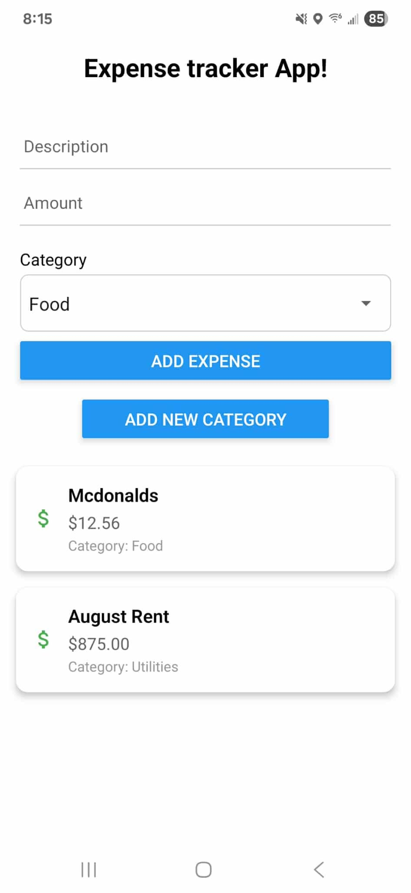

# 💰 React Native Expense Tracker

A simple and intuitive mobile app built with **React Native** and **Expo** for tracking daily expenses. Users can add expenses with categories, see a list of past expenses, and even add new custom categories.

---

## ✨ Features

- Add and delete expenses
- Choose from preset or custom categories
- Add new categories with a modal popup
- Persistent storage using AsyncStorage
- Clean and minimal UI
- Works on Android and iOS via Expo Go

---

## 📸 Screenshot



## 🚀 Getting Started

### Prerequisites

- Node.js
- Expo CLI
- Expo Go app (on your iOS/Android phone)

### Install and Run

1. Clone the repo:

```bash
git clone https://github.com/ch3xmate/ExpenseTracker.git
cd ExpenseTracker
```

2. Install dependencies:

```bash
npm install
```

3. Start the App:

You can start the Expo development server using one of the two options below:

**Option 1 (Basic Start):**

```bash
npx expo start
```

**Option 2 (Clear Cache + Tunnel - if Option 1 fails to connect your phone):**

```bash
npx expo start -c --tunnel
```

>The `-c` flag clears the Metro bundler cache, and `--tunnel` helps establish a connection if your device can't connect over LAN.

4. Scan the QR code with the Expo Go app on your phone.