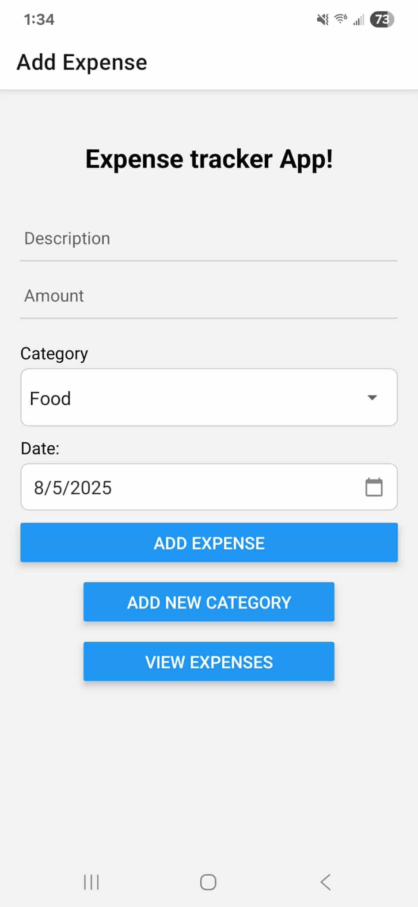
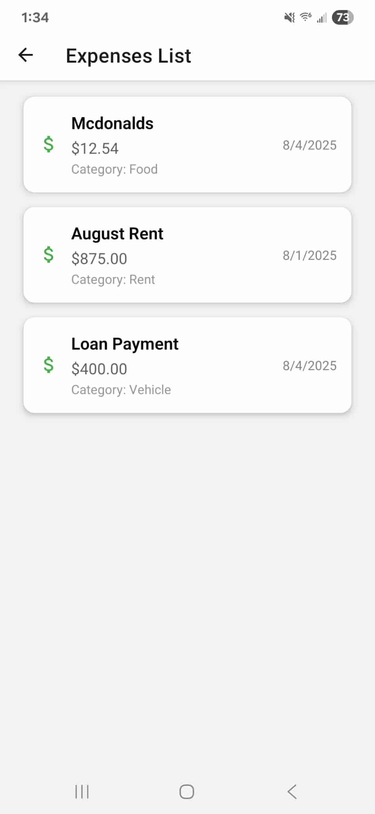

# 💰 React Native Expense Tracker

A simple and intuitive mobile app built with **React Native** and **Expo** for tracking daily expenses. Users can add expenses with categories, see a list of past expenses, and even add new custom categories.

---

## ✨ Features

- Add and delete expenses
- Choose from preset or custom categories
- Add new categories with a modal popup
- Persistent storage using AsyncStorage
- Clean and minimal UI
- Works on Android and iOS via Expo Go

---

## 📸 Screenshot

<table>
    <thead>
      <th>Main Landing Page</th>
      <th>Expense Listing page</th>
    </thead>
    <tr>
        <td>
            
        </td>
        <td>
            
        </td>
    </tr>
</table>

## 🚀 Getting Started

### Prerequisites

- Node.js
- Expo CLI
- Expo Go app (on your iOS/Android phone)

### Install and Run

1. Clone the repo:

```bash
git clone https://github.com/ch3xmate/ExpenseTracker.git
cd ExpenseTracker
```

2. Install dependencies:

```bash
npm install
```

3. Start the App:

You can start the Expo development server using one of the two options below:

**Option 1 (Basic Start):**

```bash
npx expo start
```

**Option 2 (Clear Cache + Tunnel - if Option 1 fails to connect your phone):**

```bash
npx expo start -c --tunnel
```

>The `-c` flag clears the Metro bundler cache, and `--tunnel` helps establish a connection if your device can't connect over LAN.

4. Scan the QR code with the Expo Go app on your phone.

## 📦 Dependencies

This project uses the following libraries and are installed automatically when running `npm install`:

### Runtime Dependencies

- **@expo/vector-icons** - Icon set for React Native (used with Expo)
- **@react-native-async-storage/async-storage** - Persistent local storage for saving data like expenses and categories
- **@react-native-picker/picker** - Dropdown picker component for category selection
- **@react-navigation/native** - Core utilities for navigation between screens
- **@react-navigation/native-stack** - Native stack navigator for screen transitions
- **expo** - Framework for universal React applications
- **expo-status-bar** - A drop-in replacement for the native status bar
- **react** - The core React library for building UI
- **react-native** - Framework for building native apps using React
- **react-native-safe-area-context** - Handles safe area insets on modern phones
- **react-native-screens** - Optimized screen management for navigation

### Development Dependencies

- **@babel/core** - Babel compiler core, used by Metro bundler and Expo for transforming code

